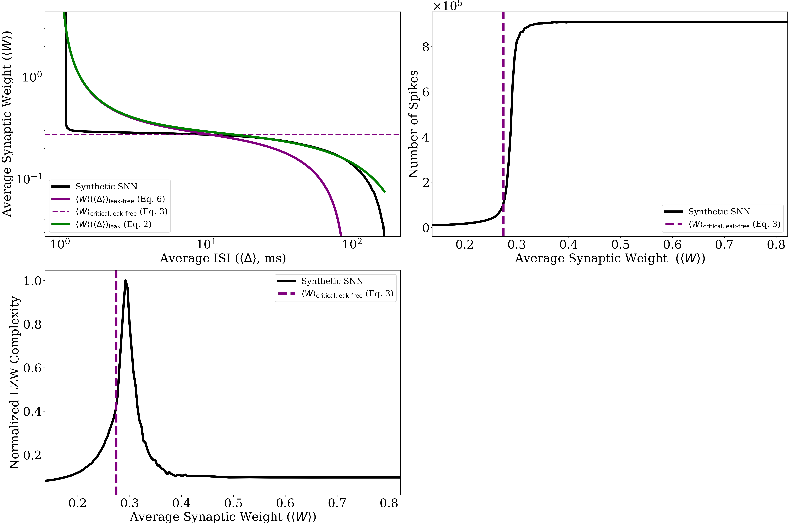

This repository contains the code for the paper **A Mean-Field Approach to Criticality in Spiking Neural Networks for Reservoir Computing**.
Simulations are performed to validate the theoretical predictions and analyze the spiking dynamics.
<div align="center">
  
  <p><i>Example of the resulting image</i></p>
</div>


### Introduction

This software simulates the behavior of a **Leak Integrate-and-Fire (LIF)** neural network with a **small-world topology**. At each iteration, the membrane potential of each neuron is updated based on the following equation: the new potential is the old potential decreased proportionally to the leak constant, plus the sum of inputs from presynaptic spikes, weighted by the synaptic weight matrix.

At each fixed time interval, an external current is applied to a randomly selected neuron, and this current is added to the membrane potential. When the membrane potential exceeds a predefined threshold, the neuron emits a spike and enters a refractory period during which it continues to update its membrane potential but cannot emit further spikes.

For further details, please refer to the paper.

## Get started
- Clone this repo or download the code
- Install the requirements.txt by running:
```bash
pip install -r requirements.txt
```
- (Optional) If you intend to integrate your experiments with CometML, add a `.env` file in the root folder:
```
COMETML_API_KEY=""
COMETML_PROJECT=""
COMETML_WORKSPACE=""
```
# SNN Simulator
The simulator described above runs for a specified duration, at the end of which the total number of spikes emitted, the average inter-spike interval (ISI), and the LZW complexity of the binary spike trains are calculated.

The simulation is repeated over a range of synaptic weights, including those near the critical weight. This process is then iterated multiple times, and the results are presented in three plots showing the relationships between:

1. Average synaptic weight vs. ISI,
2. Number of spikes vs. average synaptic weight,
3. LZW complexity vs. average synaptic weight.

The plots include shaded curves representing the first and third interquartile ranges across iterations.


## Run SNN simulation
- Adapt config_snn.yaml with desired parameters
- Run `python run_snn.py` (add the `--cometml` flag for tracking the experiment).
- Use the `--dry_run` flag to execute the script without creating a folder for results. This is useful for testing or debugging purposes:
  ```bash
  python run_snn.py --dry_run
  ```
### Configuration File: `snn-config.yaml`

The configuration file `snn-config.yaml` is used to set the parameters for running the simulations. Below is an explanation of the main parameters and their roles:

#### Example `snn-config.yaml`:
```yaml
seed: 42  # Used to generate random numbers in a reproducible way
w_means_range_num_steps: 200  # Number of points to be used for constructing a curve (i.e., how many different simulations should be run for each iteration)
experiment_repetitions: 1  # How many iterations (or complete curves) should be calculated
simulation_params:
  num_neurons: 1000  # Number of neurons in the network
  membrane_threshold: 14  # The spike emission threshold for each neuron
  currents_period: 0.01  # How often an external current is applied (in milliseconds). The value must be between 0.01 and 9.99, with at most two decimal places.
  external_current: 1.5  # The intensity of the applied external current
  leak_coefficient: 0.01  # The leak time constant for the neurons
  simulation_duration: 10000  # Number of steps for each simulation (duration of simulation for each fixed synaptic weight)
  small_world_graph_p: 0.2  # The probability of rewiring a connection in the small-world network
  small_world_graph_k: 100  # The number of nearest neighbors in the small-world network, which corresponds to twice the average degree of the network (denoted as beta*N in the paper)
```

### Key Additions:
1. **"warning" message**: A warning will be returned if parameters do not respect the limits of applicability discussed in the paper.
2. **Simulation Duration**: For some configurations, a larger simulation_duration may be required to obtain useful results, though the provided example value is sufficient for many cases.

## Repository Structure
```
.
├── src/
│   ├── __init__.py
│   ├── models.py         # SNN model classes and logic
│   ├── snn_plots.py      # Plotting utilities for the SNN
│   └── utils.py          # Utility functions (e.g., config loader)
├── run_snn.py            # Main script to run SNN simulations
├── snn_config.yaml       # Configuration file for SNN simulations
├── requirements.txt      # Python dependencies
└── README.md             # Top-level documentation and instructions
```
